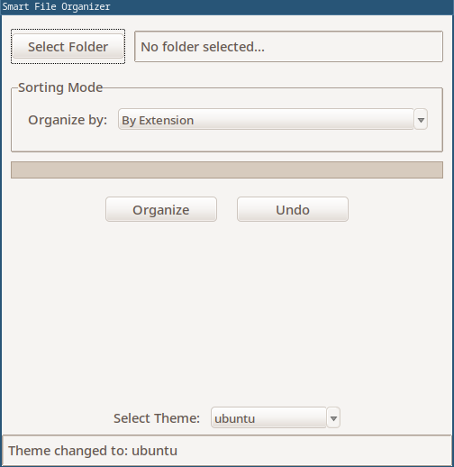

# 🚀 Smart File Organizer

A cross-platform desktop utility to automatically sort files in a folder based on flexible rules.



---

## 🌟 Features

* **Multiple Sort Modes:** Organize files based on one of three modes:
    * **By Extension:** Sorts files by type (`.pdf`, `.jpg`, `.txt`, etc.).
    * **By Time:** Sorts files by modification date (Year, Month, Day, Minute, etc.).
    * **By Keyword:** Sorts files into custom folders based on keywords in their name.
* **Custom Keyword Rules:** Map multiple keywords or groups of keywords to specific destination folders using a simple syntax.
* **Multi-Level Undo:** Undo one or more organization jobs. The app automatically cleans up any empty folders it created during the undone operation.
* **Non-Blocking UI:** File operations run in a background thread, so the app never freezes, even on large folders. A progress bar shows the current status.
* **Themeable:** Pick from dozens of themes. Your choice is saved to `.organizer_config.json` and loaded on startup.
* **Logging:** All file moves are logged to `organizer.log` for debugging or review.
---

## ⚙️ How to Use

1.  **Select Folder:** Click the "Select Folder" button to choose the directory you want to organize.
2.  **Choose Mode:** Select your organization method from the "Organize by:" dropdown.
3.  **Define Rules (If needed):**
    * If sorting **By Time**, select your desired granularity (e.g., "Year", "Month", "Minute").
    * If sorting **By Keyword**, fill in the two text boxes:
        * **Keyword Groups:** Enter keywords separated by commas (`,`). Separate *groups* of keywords with a semicolon (`;`).
        * **Destination Folders:** Enter the folder names for each group, also separated by a semicolon. The number of folders must match the number of keyword groups.
4.  **Click Organize!** The app will sort your files based on your rules and show a confirmation.
5.  **Click Undo** to revert the most recent organization batch at any time.

---

## 📦 Installation

### For Users

You can run this app without a traditional installation.

1.  Go to the **Releases** page of this GitHub repository.
2.  Download the latest executable for your operating system (`SmartFileOrganizer.exe` for Windows, `SmartFileOrganizer` for Linux).
3.  On Linux, you may need to make the file executable: `chmod +x SmartFileOrganizer`.
4.  Run the file. That's it!

### For Developers

If you want to run or build from the source code:

1.  **Clone the repository:**
    ```bash
    git clone [https://github.com/your-username/smart-organizer.git](https://github.com/your-username/smart-organizer.git)
    cd smart-organizer
    ```

2.  **Ensure Tkinter is installed:**
    This app requires `tkinter` (for the GUI), which is part of the Python standard library but is sometimes omitted in minimal Linux installs. It **cannot** be installed with `pip`.

    * **On Debian/Ubuntu:** `sudo apt-get install python3-tk`
    * **On Arch Linux:** `sudo pacman -S tk`
    * **On Fedora:** `sudo dnf install python3-tk`
    * (On Windows and macOS, `tkinter` is typically included with the default Python installer.)

3.  **Create and activate a virtual environment:**
    ```bash
    # On Linux/macOS
    python3 -m venv venv
    source venv/bin/activate

    # On Windows
    python -m venv venv
    venv\Scripts\activate
    ```

4.  **Install Python dependencies:**
    ```bash
    pip install -r requirements.txt
    ```

5.  **Run the app:**
    ```bash
    python organizer.py
    ```
---

## 📋 Requirements

This app's runtime dependencies are:

```
pillow==12.0.0
ttkthemes==3.3.0
```